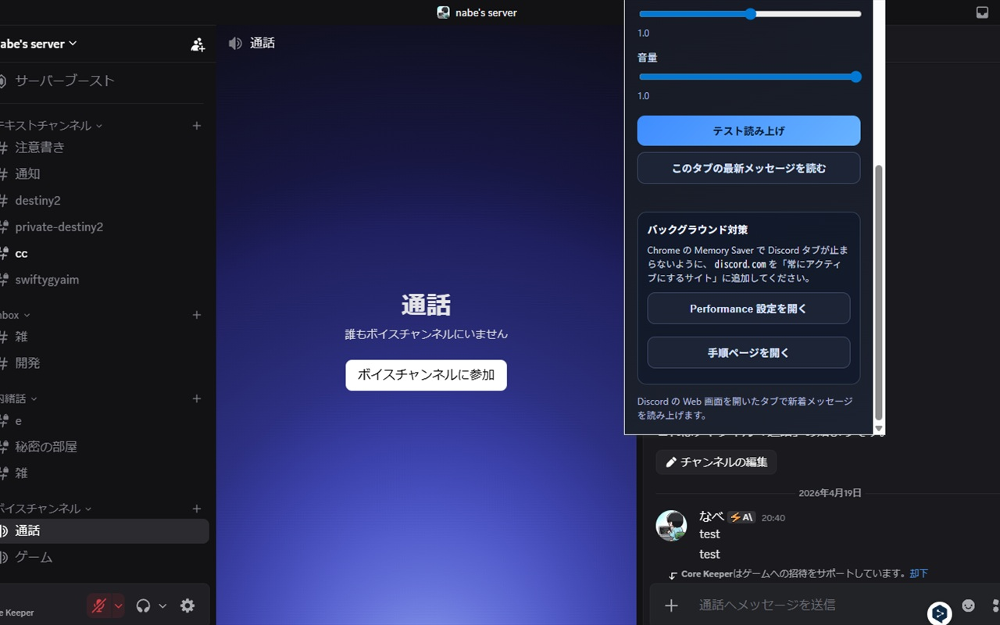
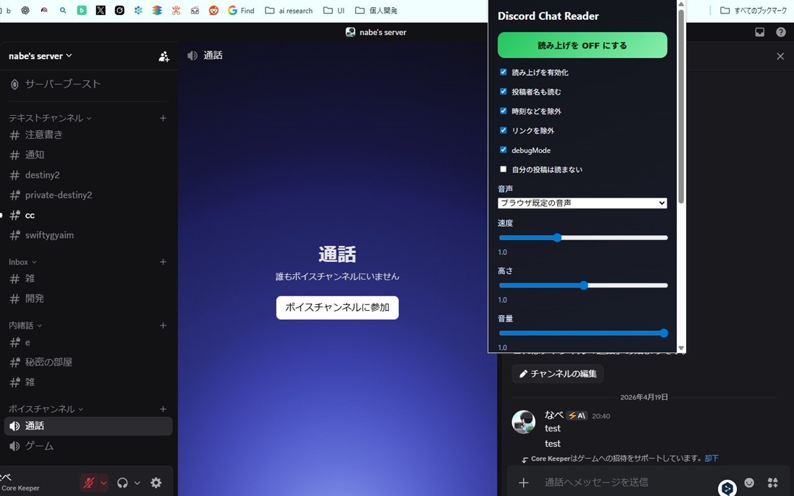

# Discord Chat Reader

Discord の Web 版チャットを Chrome 上で開いたまま、新着メッセージを読み上げる拡張機能です。

## できること

- `discord.com` / `ptb.discord.com` / `canary.discord.com` の `channels/*` で動作
- 新しく追加されたメッセージだけを読み上げ
- 新着が続いたときも順番にキューして読み上げ
- 投稿者名の読み上げ ON/OFF
- URL や時刻など不要な情報の除外
- 音声、速度、高さ、音量の調整
- バックグラウンド読み上げへの対応
- ポップアップのトグルボタン、または `Alt+Shift+R` で ON/OFF 切り替え

## スクリーンショット

## 使い方

1. Chrome で `chrome://extensions` を開く
2. 右上の「デベロッパー モード」を ON にする
3. 「パッケージ化されていない拡張機能を読み込む」を押す
4. このフォルダを選ぶ
5. Discord Web (`https://discord.com/channels/...`) を開く
6. 拡張のポップアップから読み上げ設定を調整する

## 補足

- 右上の拡張バッジに `ON` / `OFF` が表示されます
- 既定ショートカットは `Alt+Shift+R` です。必要なら `chrome://extensions/shortcuts` で変更できます
- バックグラウンド利用時は、Chrome の設定で `discord.com` を「常にアクティブにするサイト」に追加すると安定しやすくなります

## 実装メモ

- Discord は SPA なので、DOM 変化を `MutationObserver` で監視しています
- 既存ログは初回ロード時に既読扱いにして、新着だけを読みます
- 読み上げ処理は offscreen document 側で行うため、タブがバックグラウンドでも継続しやすい構成です
- Discord 側の DOM 構造が変わるとセレクタ調整が必要になる可能性があります
